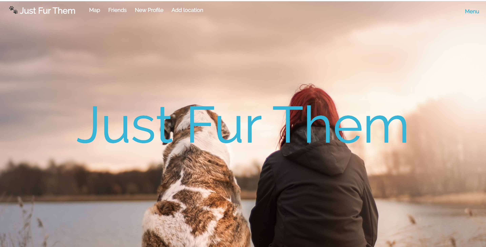
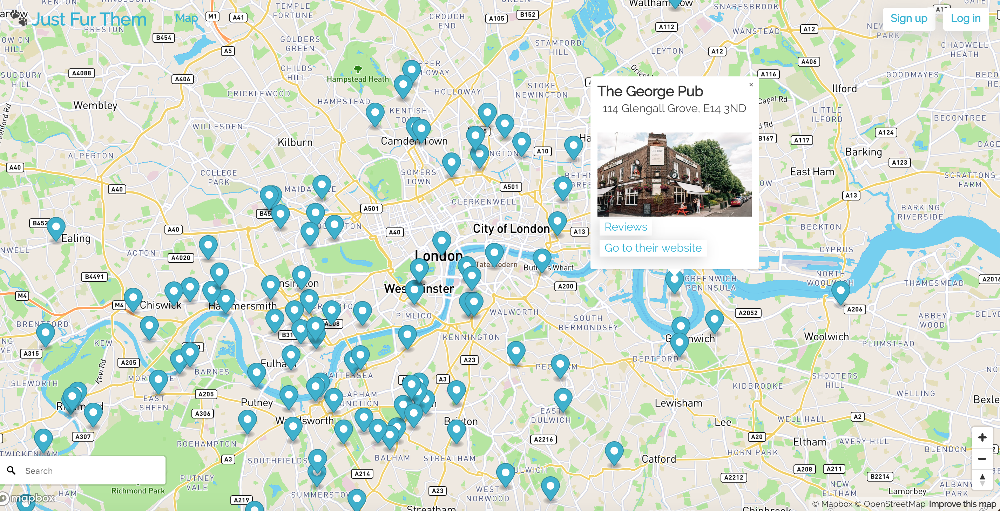
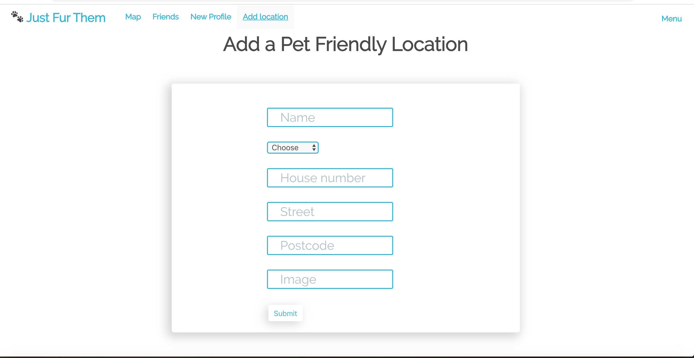
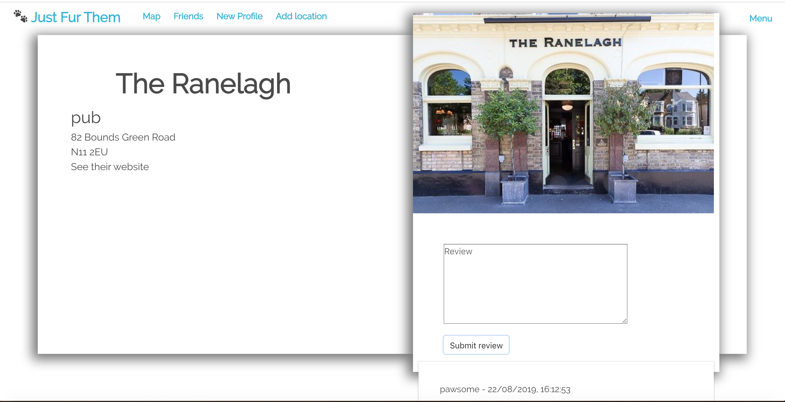
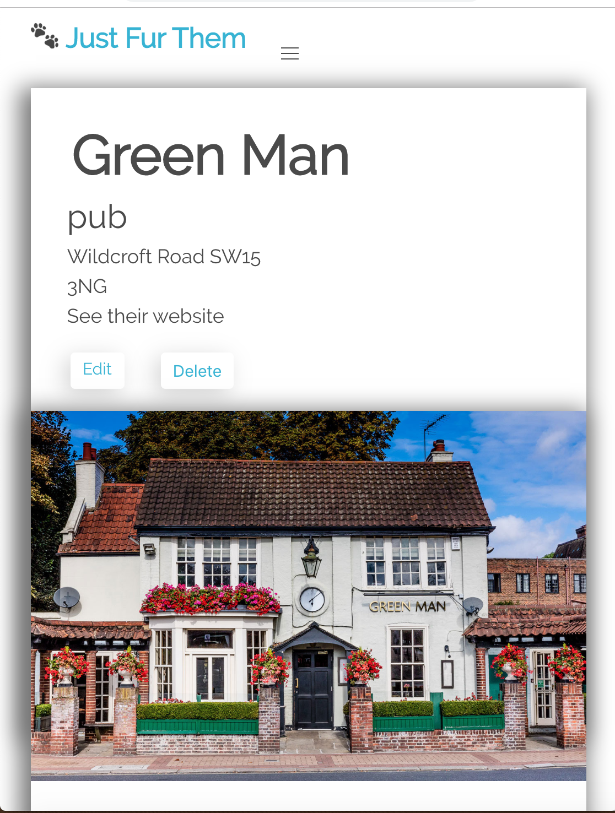
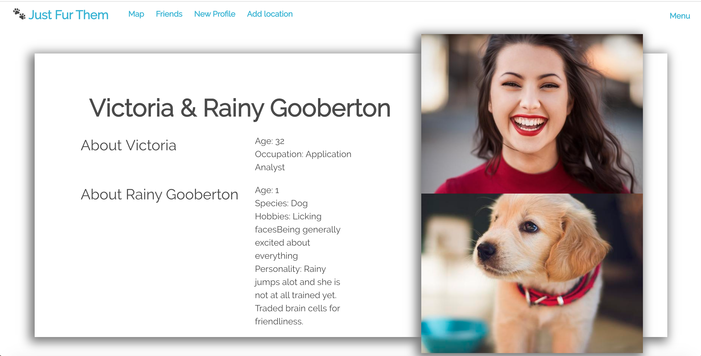

​
# General Assembly – Project 3
This was the third project during the General Assembly Software Engineering Immersive course (Week 9).

## Brief
The app must deliver something of value to the end-user with a visually impressive design, ideally should be mobile responsive.

It should store user generated content (UGC) by authenticated users who login to upload content they have generated

Users must have a fully functional CMS using the MERN stack (Mongo-Express-React-Node) to upload content

The user flow from the front end (logged out and logged in) experience to the back end use of data must be simple, bug-free and fully functional

The database should store 3-4 data-schemas. At least one embedded or referenced schema.

A minimum of one external API should be integrated

A complete CRUD (Create, Read, Update, Delete) cycle must be integrated into the user experience and be tested, demonstrating test-driven-development

The project should be deployed (fully-working and bug-free) on Heroku

​
## Timeframe & Team
​
1 week

The Team:
* Kasia: https://github.com/kasiaaguti
* Amy: https://github.com/amydaniellewilson
* Talha: https://github.com/talhaikhlaq
​
## Technologies

| Front End | Back End | Testing | Other |
|:---:|:---:|:---:|:---:|
| React | Node.js | Mocha | yarn |
| ReactDOM | MongoDB | Chai | Webpack |
| React Router DOM | Express |  Babel |
| Bulma | Mongoose | | Axios |
| mongoose  | | |
| Mapbox GL JS | JSON Web Tokens (JWT) | | |
| | bcrypt | | |
| | dotenv | | &nbsp; |

## Deployment
​
This website is deployed on Heroku and it can be found here: https://just-fur-them.herokuapp.com/


## Team Organisation - Loose Agile Framework

- Decisions made democratically
- Trouble shoot early and often
- Seek to solve the problem with root cause analysis
- The whole team is responsible for positive outcomes and good quality code

## Wins

- Key technologies used by everyone
- Good work flow organisation thanks to Trello
- All team members happy with the end result


## Concept

It is  social a hub for people who have pets. It has features similar to Meetup where login users can create profiles to connect with each other to meet with other pet owners in their area.

A big part of the project is listing and showing on a map pet friendly pubs, restaurants and cafes in London. Logged in users can add and review venues. Not logged in users can see the map and read reviews, but can't add any of those.

## Code - backend

**Location Schema**
```
const locationSchema =  new mongoose.Schema({
  name: { type: String, required: true },
  category: { type: String, required: false },
  address: {
    buildingNumber: { type: String },
    street: { type: String, required: false },
    city: { type: String },
    postcode: { type: String, required: false }
  },
  coordinates: {
    lat: { type: Number },
    lng: { type: Number }
  },
  website: { type: String },
  image: { type: String },
  comments: [ commentSchema ],
  user: { type: mongoose.Schema.ObjectId, ref: 'User', required: true }
})

```

**Secure route**
```
function secureRoute(req, res, next) {
  if (!req.headers.authorization) return res.status(401).json({ message: 'Unauthorized' })

  const token = req.headers.authorization.replace('Bearer ', '')

  new Promise((resolve, reject) => {
    jwt.verify(token, secret, (err, payload) => {
      if (err) return reject(err)
      return resolve(payload)
    })
  })
    .then(payload => User.findById(payload.sub))
    .then(user => {
      if (!user) return res.status(401).json({ message: 'Unauthorised' })
      req.currentUser = user
      next()
    })
    .catch(next)
}

```

## Code - frontend

**Connectin Chatkit**
```
startChatkit() {
  console.log('starting chat')
  const chatManager = new Chatkit.ChatManager({
    instanceLocator: instanceLocator,
    userId: userId,
    tokenProvider: new Chatkit.TokenProvider({
      url: testToken
    })
  })


  chatManager.connect()
    .then(currentUser => {
      this.currentUser = currentUser
      this.currentUser.subscribeToRoom({
        roomId: this.state.currentChatroom,
        hooks: {
          onMessage: message => {
            this.setState({
              registered: true,
              messages: [...this.state.messages, message]
            })
          }
        }
      })
    })
    .catch(err => {
      console.log(err)
      if (err.info.error_description === 'The requested user does not exist') {
        console.log('User does not exit')
        this.setState({ registered: false })
      }
    })
}
```  

**Changing postcodes into geographic coordinates**
```
translatePostcode() {
  const { postcode } = this.state.data.address
  axios.get(`https://postcodes.io/postcodes/${postcode}`)
    .then(res => {
      const coordinates = {
        lat: res.data.result.latitude,
        lng: res.data.result.longitude
      }
      const data = { ...this.state.data, coordinates }
      this.setState({ data }, () => this.newLocation())
    })
    .catch(err => console.log(err.response))
}
```
## Visuals

**Landing page**



**Home page scrolls down, navbar changes colour at scrolling**


**Map showing pet friendly locations**




**Logged in users can add new locations**




**Location page. Logged in users can review venues. Not logged in users can see locations and read reviews, but can't add any.**





**Responsive design**




**Profile page**





## Challenges

It was challenging to learn how to use Github while working on collaborative project.  

Connecting Chatkit.

We used Mapbox to show the locations of all companies listed on the website. As Mapbox doesn’t use addresses, but only geographical coordinates we added latitude and longitude to all locations while creating a seed file. It wouldn’t be user friendly to  ask our users to do the same when adding their locations, so we used public API (https://postcodes.io) that converts postcodes into geographic coordinates.

## Future improvements

App has a chat/forum function for particular neighbourhoods. Next stage of developing this website would be adding private messages functionality.


## Key learnings
Building a functioning full-stack app where requests can successfully display information on the front end (read) and data can be created/updated/deleted on the back end.

Working with Github on a group project.
